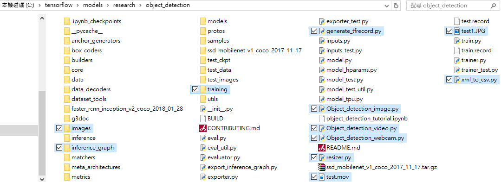
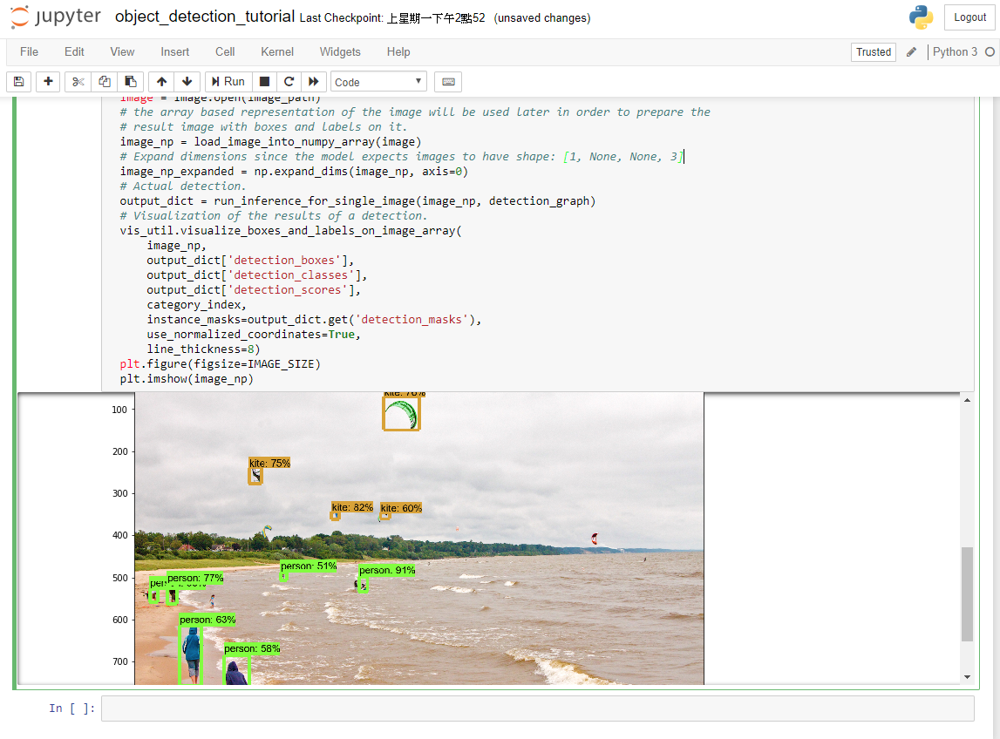
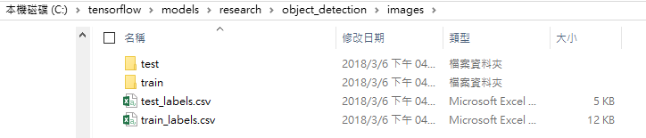
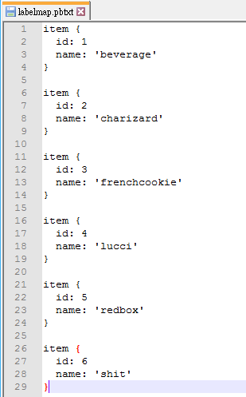
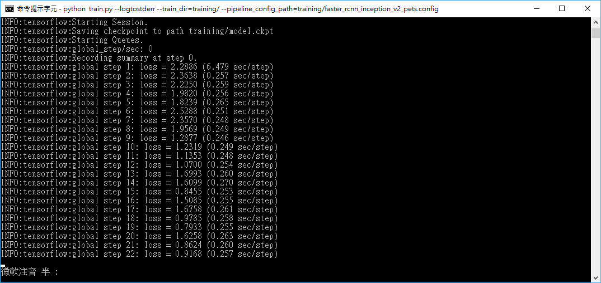
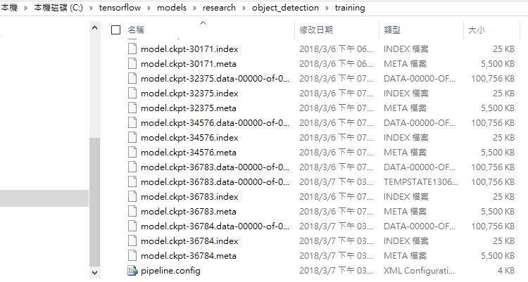
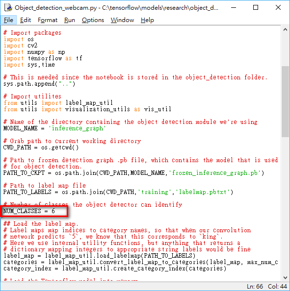
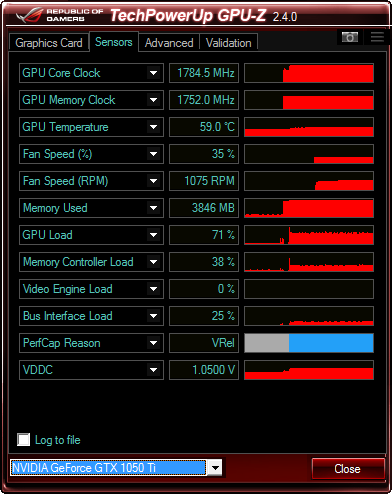

# Tensorflow Object Detection API
Tensorflow object detection API，參考
[這篇](https://github.com/EdjeElectronics/TensorFlow-Object-Detection-API-Tutorial-Train-Multiple-Objects-Windows-10)
實作出來，順便把步驟記錄起來。

# Step
### 1. Install environment
1.安裝anaconda 環境
去[官網](https://www.anaconda.com/download/)下載安裝，下一步到底即可。

2.建立虛擬環境
開啟cmd，並新增虛擬環境，在tensorflow的地方輸入環境名稱與python版本，建議是用3.5。可以參考[這篇](https://www.tensorflow.org/install/install_windows#installing_with_anaconda)
```
conda create -n tensorflow pip python=3.5
```
進去虛擬環境
```
activate tensorflow
```
2.安裝 tensorflow1.5 or以上
 ```
 # for gpu
 pip install --ignore-installed --upgrade tensorflow-gpu
 # for cpu
 pip install --ignore-installed --upgrade tensorflow
 ```
3.安裝protobuf與其他套件

```
conda install -c anaconda protobuf
pip install pillow lxml jupyter matplotlib pandas opencv-python
```

4.在C:\ 建立個tensorflow資料夾，把 [這個](https://github.com/EdjeElectronics/TensorFlow-Object-Detection-API-Tutorial-Train-Multiple-Objects-Windows-10) 與 [這個](https://github.com/tensorflow/models)
的repository下載下來放進來，並把 EdjeElectronics 這個作者的repository放至自己C:\tensorflow\models\research\object_detection 路徑底下。



5.把 [這裡](https://github.com/tensorflow/models/blob/master/research/object_detection/g3doc/detection_model_zoo.md)
的 faster_rcnn_inception_v2_coco 下載下來並放在 research\object_detection 底下


6.把 object_detection\ 底下的 Training、inference_graph、images\Train、images\Test 資料夾內容全清空
並刪除 object_detection\images 底下的 test_labels.csv及train_labels.csv 檔案。

### 2. 設定環境變數
1.設定PYTHONPATH

```
set PYTHONPATH=C:\tensorflow\models;C:\tensorflow\models\research;C:\tensorflow\models\research\slim
set PATH=%PATH%;PYTHONPATH
```
* 如果你放置的資料夾不在C:\底下，請改成自己放置的位置。

2.編譯Protobufs及安裝setup.py
cd 至 \models\research 底下，把下面這段貼上去編譯他。
```
protoc --python_out=. .\object_detection\protos\anchor_generator.proto .\object_detection\protos\argmax_matcher.proto .\object_detection\protos\bipartite_matcher.proto .\object_detection\protos\box_coder.proto .\object_detection\protos\box_predictor.proto .\object_detection\protos\eval.proto .\object_detection\protos\faster_rcnn.proto .\object_detection\protos\faster_rcnn_box_coder.proto .\object_detection\protos\grid_anchor_generator.proto .\object_detection\protos\hyperparams.proto .\object_detection\protos\image_resizer.proto .\object_detection\protos\input_reader.proto .\object_detection\protos\losses.proto .\object_detection\protos\matcher.proto .\object_detection\protos\mean_stddev_box_coder.proto .\object_detection\protos\model.proto .\object_detection\protos\optimizer.proto .\object_detection\protos\pipeline.proto .\object_detection\protos\post_processing.proto .\object_detection\protos\preprocessor.proto .\object_detection\protos\region_similarity_calculator.proto .\object_detection\protos\square_box_coder.proto .\object_detection\protos\ssd.proto .\object_detection\protos\ssd_anchor_generator.proto .\object_detection\protos\string_int_label_map.proto .\object_detection\protos\train.proto .\object_detection\protos\keypoint_box_coder.proto .\object_detection\protos\multiscale_anchor_generator.proto
```
編譯好後，要build與install他。
```
python setup.py build
python setup.py install
```

3.執行官方的範例
cd 至 object_detection底下，執行
```
jupyter notebook object_detection_tutorial.ipynb
```
跑道最下面如果有圖片跑出來代表沒問題。



### 3.取得圖片label
從 [這裡](https://github.com/tzutalin/labelImg#labelimg) 下載LabelImg，目的是為了要把圖片的label標記起來，讓rcnn做分析。

下載Windows v1.6 [連結](https://www.dropbox.com/s/tq7zfrcwl44vxan/windows_v1.6.0.zip?dl=1)。

下載完後把要訓練與測試的圖片放至images\Train、images\Test底下，並把物體標記起來。


把images\Train、images\Test底下的所有圖片都要標記起來，此專案用了6種不同物體各40張，共240張做訓練，測試共100張。

### 4.產生訓練資料

至 object_detection\ 底下，執行

```
python xml_to_csv.py
```

會在 images\ 底下找到



接著，開啟 generate_tfrecord.py，把以下這段改成自己的label，比方說自己的資料集類別有 籃球、足球、羽球。

原本的：
```
# TO-DO replace this with label map
def class_text_to_int(row_label):
    if row_label == 'beverage':
        return 1
    elif row_label == 'charizard':
        return 2
    elif row_label == 'frenchcookie':
        return 3
    elif row_label == 'lucci':
        return 4
    elif row_label == 'redbox':
        return 5
    elif row_label == 'shit':
        return 6
    else:
        None
```

修改後：

```
# TO-DO replace this with label map
def class_text_to_int(row_label):
    if row_label == 'basketball':
        return 1
    elif row_label == 'soccer':
        return 2
    elif row_label == 'badminton':
        return 3
    else:
        None
```

執行這兩行語法

```
python generate_tfrecord.py --csv_input=images\train_labels.csv --image_dir=images\train --output_path=train.record
python generate_tfrecord.py --csv_input=images\test_labels.csv --image_dir=images\test --output_path=test.record
```

### 5.建立label map 與設定 training
1.建立 label map

在 \models\research\object_detection\training底下建立一個 labelmap.pbtxt 的檔案。
並在檔案裡面寫入這些。



```
item {
  id: 1
  name: 'beverage'
}

item {
  id: 2
  name: 'charizard'
}

item {
  id: 3
  name: 'frenchcookie'
}

item {
  id: 4
  name: 'lucci'
}

item {
  id: 5
  name: 'redbox'
}

item {
  id: 6
  name: 'shit'
}
```

記得這邊也要改成自己的資料集類別

```
item {
  id: 1
  name: 'basketball'
}

item {
  id: 2
  name: 'soccer'
}

item {
  id: 3
  name: 'badminton'
}
```

2.設定training

從 C:\tensorflow1\models\research\object_detection\samples\configs 中複製 faster_rcnn_inception_v2_pets.config 檔案並修改他。

* 第9行： num_classes: 6，改成自己資料集的類別，如果自己的資料集有籃球、足球、羽球，就改成3。
* 第110行： fine_tune_checkpoint: 改成自己的faster_rcnn_inception_v2_coco_2018_01_28/model.ckpt路徑。
    - ex: fine_tune_checkpoint: "C:/tensorflow/models/research/object_detection/faster_rcnn_inception_v2_coco_2018_01_28/model.ckpt"
* 第126行與第128行： 請改成自己的路徑。
  - input_path : "C:/tensorflow/models/research/object_detection/train.record"
  - label_map_path: "C:/tensorflow/models/research/object_detection/training/labelmap.pbtxt"
* 第132行： num_examples: 100，改成自己測試集的總個數。
* 第140行與第142行：  請改成自己的路徑。
  - input_path : "C:/tensorflow/models/research/object_detection/test.record"
  - label_map_path: "C:/tensorflow/models/research/object_detection/training/labelmap.pbtxt"

最後，記得儲存。

### 6.執行 train.py

至 object_detection\ 底下執行下面這行。

```
python train.py --logtostderr --train_dir=training/ --pipeline_config_path=training/faster_rcnn_inception_v2_pets.config
```

如果沒問題，他會這樣。



用GPU-Z 觀察GPU的狀態。


可以用TensorBoard查看。

```
tensorboard --logdir=training
```


本專案並沒有全程跑完，跑到後面loss已經非常低了，因此中斷訓練。

### 7. 輸出 Inference Graph

執行這一行，其中的 model.ckpt-XXXXX 為當時的checkpoint到哪決定，例如本專案至36784，那XXXXX就填入36784。



```
python export_inference_graph.py --input_type image_tensor --pipeline_config_path training/faster_rcnn_inception_v2_pets.config --trained_checkpoint_prefix training/model.ckpt-XXXXX --output_directory inference_graph
```

### 8.使用你訓練的模型

至 object_detection\ 路徑下打 idle，就可以跑出python的idle，在用這個idle開啟 Object_detection_webcam.py 。
* 如果有image or video就開啟其他的python檔。

開啟後修改一下，如果你訓練的資料集類別有3個就填入3個，本專案是6種類別。



Demo：


會發現，當在 run model 時會非常吃顯卡效能，本專案是使用 GTX 1050 Ti，FPS差不多為2~3，而且記憶體都會吃好吃滿，堪用而已。




# Error & Answer
1.No module named 'object_detection'

[Answer](https://github.com/tensorflow/models/issues/2031)

2.ImportError: No module named deployment

[Answer](https://github.com/tensorflow/models/issues/1992)

3.TypeError: __init__() got an unexpected keyword argument 'dct_method'

[Answer](https://github.com/tensorflow/models/issues/3476)

4.TypeError: Expected int32, got range(0, 3) of type 'range' instead.

[Answer](https://github.com/tensorflow/models/issues/3443)

5.Loaded runtime CuDNN library: 7005 (compatibility version 7000)
but source was compiled with 7101 (compatibility version 7100).
If using a binary install, upgrade your CuDNN library to match.
If building from sources, make sure the library loaded at runtime matches a compatible version specified during compile configuration.

[Answer](https://github.com/tensorflow/tensorflow/issues/17422):install libcudnn 7.0.5


6.ImportError: Could not find 'cudart64_90.dll'.
TensorFlow requires that this DLL be installed in a directory that is named in your %PATH% environment variable.
Download and install CUDA 9.0 from this URL: https://developer.nvidia.com/cuda-toolkit

Answer: install  [cuda 9.0](https://developer.nvidia.com/cuda-downloads)

7.ImportError: No module named 'tensorflow.tensorboard.tensorboard'

[Answer](https://github.com/tensorflow/tensorflow/issues/1790)

8.import cv2 ImportError: DLL load failed

[Answer](http://blog.csdn.net/zyfortirude/article/details/70176705): remove and install [opencv](https://www.lfd.uci.edu/~gohlke/pythonlibs/#opencv).


# 致謝
最後，本專案只是把 EdjeElectronics 作者的 [這篇](https://github.com/EdjeElectronics/TensorFlow-Object-Detection-API-Tutorial-Train-Multiple-Objects-Windows-10)
實作出來，並把步驟記錄起來，實際上在 run 的時候會有需多問題，可以參考 [這篇](https://www.youtube.com/watch?v=Rgpfk6eYxJA)
，影片下方留言有可能遇到的錯誤與解決辦法，如果讀者使用的是我的專案的話，
把整個專案下載下來並放在自己建立的 C:\tensorflow\models\research\object_detection 底下，把整個object_detection覆蓋即可
如有問題可以提出，我會的盡量回答，太過深奧的理論我也不懂，希望能幫助可以幫助的人。
